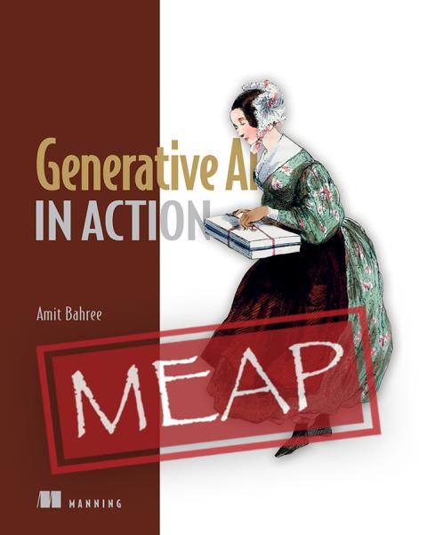

# Book - Generative AI in Action
Welcome to the code repo associated with my book [**Generative AI in Action**](https://www.manning.com/books/generative-ai-in-action), published by Manning.

This repo has a few things that might be of interest:
* Code from the different examples in the book.
* List of research papers associated with different AI technology and techniques.
* A Web application you can run locally brings many of these concepts together.
* Detailed instructions for getting dependencies installed locally.

| :warning: **Warning:** OpenAI API Breaking Changes |
| --- |
The book's code works with the new API (v1.0) that OpenAI recently updated. If you have an old package version (v0.28), upgrade to the latest version for the code to work. To upgrade the package, you can run the following command: `pip install --upgrade openai`. If you are using conda, you can run the command: `conda update openai`.

## Core dependencies :minidisc:
Before we start installation instructions, as outlined in the book, we assume you have installed the following basic dependencies. For most developers and data scientists, these would already be in place, and there might not be any additional steps needed. 

Note: If any of these are missing and need step-by-step instructions, see detailed <a href="docs/detailed-instructions.md" target="_blank">dependency installation instructions</a>.
* **IDE:** <a href="https://code.visualstudio.com/" target="_blank">Visual Studio Code</a> (or similar) 💻.
* **Python:** Version `3.7.1` or later; we use version `3.11.3` for the book.
  *  To check the Python version installed, run: `python --version` 
* **Package manager:** Although technically a package manager is  not needed, it would make things much easier to maintain. We use `conda` for the book, but you can use any you prefer.
* **Git:** Given we are using GitHub, you need Git installed locally.

## Installation instructions :books:
The steps to get the environment up and running can be found in the <a href="docs/installation.md" target="_blank">installation instructions</a>. 

## Where is the Code? :file_folder:
The book's code is organized by chapters as expected and is in the folder called [**`chapters`**](chapters/readme.md). You will find a folder for each chapter following the convention of ch{chapter-number}.

You can find some utility functions and programs in the **`utils`** folder.

## Web Application :earth_americas:
In addition to the code from the chapter, a fully functional web application brings all the different constructs together in an easy-to-navigate web application that you can run locally. The code for this can be found in the **`webapp`** folder. :panda_face:  

**Note:** :information_source: The web application is meant only as a reference to run locally and not exposed to the internet. It does not have all the necessary proxies and controls one would build when exposing an application to the internet.

## Papers :page_facing_up:
LLM and Generative AI are still quite new, and as a result, there is a fascinating list of very active research. You can find a pointer to many of these  in the [**`paper`**](papers/readme.md) folder . These are organized by Chapter to help you navigate. 

The reader is not expected to know these but as with most things, it is always good to go deeper and grok some of these concepts for a better and fuller understanding.

## Contact
You can see my <a href="https://github.com/bahree" target="_blank">GitHub profile</a> for different ways to get in touch. If there are any questions, or issues, please submit an Issue.

## License
The work as part of this repo is shared under <a href="LICENSE" target="_blank">MIT License</a>. 
In summary, this is a short and simple permissive license with conditions only requiring the preservation of copyright and license notices. Licensed, modified, and larger works may be distributed under different terms and without source code.
