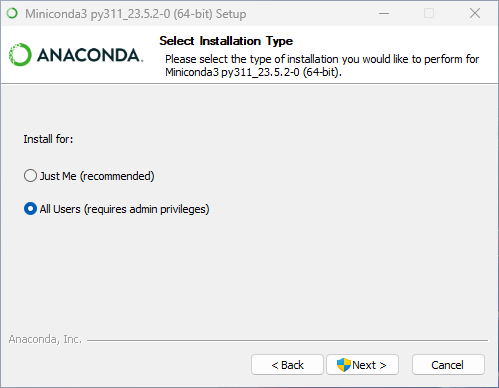

# Core Dependency Installation Instructions
This document outlined details of the basic installation instructions. 

**Note:** We use Windows 11 with the Linux subsystem, in showing this example. However there is nothing in these that is specific to Windows, and you can use the same, or very similar instructions across both Mac OS, and different flavors of Linux.

## Installing Visual Studio Code
If you don't already have an IDE, you can use <a href="https://code.visualstudio.com/" target="_blank">Visual Studio Code</a> for free; you can read up more on Visual Studio Code here, and download and <a href="https://code.visualstudio.com/download" target="_blank">install it from here</a>.

## Installing Conda
To install **Conda** on **Windows 11**, you can follow the steps below. For our purposes we use Miniconda but you can also use Anaconda if that is preferred.

1. Download the installer from the <a href="https://docs.conda.io/projects/conda/en/latest/user-guide/install/index.html" target="_blank">official website</a>. You can choose between the **Miniconda** installer or the **Anaconda** installer.
2. Verify the installer hashes.
3. Double-click the `.exe` file and follow the instructions on the screen. If you are unsure about any setting, accept the defaults. You can change them later.
4. Once installation is complete, open the **Anaconda Prompt** from the Start menu.
5. To verify that Conda has been installed correctly, run `conda list` in your terminal window or Anaconda Prompt. A list of installed packages appears if it has been installed correctly.

The step-by-step install instructions for Miniconda are shown below.
1. Run the installer  

2. Agree to the T&Cs  

3. Select install type - I prefer All Users.  
  
4.Choose Install Location - I just keep the defaults  

5. Advanced Installation options - I select the clear cache option  

6. Installing  

7. Installation Complete  

8. Initialize `conda` for PowerShell but running `conda init powershell`. This needs to be in a new console window, after the installation is done.  

9. Update base conda packages by running `conda update --all`  

## Installing Python
To check which version of Python is installed run the following command: `python --version`. If Python is not installed you will see an error similar to the one shown below.  

You can install Python using two ways on Windows as outlined below.

Here are the steps to install Python on Windows 11:
1. Open a web browser and navigate to the [Python website](https://www.python.org/downloads/).
2. Download the Windows installer for Python 3.x.
3. Double-click on the downloaded file and follow the installation wizard.
4. During installation, select the option to add Python to your system's PATH environment variable. This will allow you to run Python from any directory in the command prompt.
5. Once installation is complete, open a command prompt and type `python` to verify that Python is installed correctly.

Alternatively, you can install Python via the Microsoft Store by following these steps:
1. Open the Microsoft Store app.
2. Search for "Python" in the search bar.
3. Select the version of Python you want to install and click "Get".
4. Wait for the installation process to complete.

Step-by-step install instructions for Python are shown below.
1. Make sure to select the option for adding python to PATH.  

2. Installation in progress  

3. Disable the path length limit  

4. Completed  

5. Restart your CLI for the path to reflect.  

## Installing Git
To install **Git** on **Windows**, you can follow the steps below:

1. Download the latest Git for Windows installer from the <a href="https://github.com/git-guides/install-git" target="_blank">official website</a>.
2. Run the installer with administrator privileges and follow the instructions on the screen.
3. Once installation is complete, open a command prompt or Git Bash and run `git version` to verify that Git has been installed correctly as we see below.  

If you need more detailed instructions, you can refer to one of these video tutorials:
1. [How to Install Git on Windows - How-To Geek](https://www.howtogeek.com/832083/how-to-install-git-on-windows/) by How-To Geek.
2. [Install Git | Atlassian Git Tutorial](https://www.atlassian.com/git/tutorials/install-git) by Atlassian.

