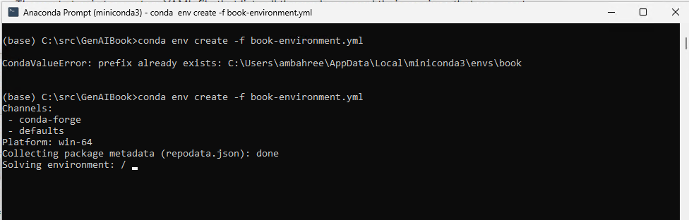

## Installation Instructions
### 1. Create Conda Environment
First think we need to do is create a new conda environment. Of course if you have an existing environment that works, then you don't need to do this. This assumes you have all the core dependencies installed and configured.

We do this by running the following command in a terminal that is already configured for conda.
`conda create -n book python=3.11.3`  
In our case, we can see the base environment in conda is active, as shown by `(base)`.  
  

We will be asked for confirmation to proceed, and once completed we will see a confirmation as shown in the following two screens.  
  
  

We activate the environment as shown below using:  `conda activate book`. Note, if the environment hasn't changed we need to initialize conda again for PowerShell by running `conda init powershell`  
  

We can see our environment created, and is the active one as denoted with the asterix.
  

### 2. Install the runtime packages
We install the needed runtime packages using conda by running the following:
`conda install -c conda-forge openai streamlit tiktoken python-dotenv
`.

We also need to install streamlit-chat by itself for some reason:

`conda install -c anaconda streamlit-chat`.

If you happen to not be using conda, but are using pip, we install the needed runtime packages by running the following: `pip install -r requirements.txt`  

| :warning: **Warning:** OpenAI API Breaking Changes |
| --- |
OpenAI recently updated its API, and the code in the book is incompatible with the new API (v1.0). Unfortunately, this new version introduces breaking changes, which, while insignificant, are still breaking. I am working on updating the code and will have it available soon. If you are doing a fresh installation and want to follow the code in the chapters, it might be best to pin the installation to the older API version (v0.28).
If you are using pip, you can run the following command: `pip install openai==0.28.0`. Using conda, you can run the command: `conda install -c conda-forge openai=0.28.0`.

Depending on how many new packages need to be installed, and your internet speed, this can take a few minutes. You will see the output of this similar to the ones shown below - the first one when starting out, and the second one when finishing.
  
  

### 3. Configure the API Keys
We use a combination of environment keys, and reading from a file to configure the API keys. The reason for this is that we don't want to check in the API keys into GitHub, and we also want to make it easy to run the code without having to set up the environment variables. The steps for both are shown below.

#### 3.1 Configure the environment variables
We need to set the following environment variables:
* `AOAI_ENDPOINT` - This is the endpoint for the Azure OpenAI service.
* `AOAI_KEY` - This is the key for the Azure OpenAI service.
* `STABILITY_API_KEY` - This is the variable that stores the API key for Stability AI.
* `OPENAI_API_BOOK_KEY` - This is the key for OpenAI API (not to be confused with the Azure OpenAI key which is shown earlier)
* `OPENAI_API_BOOK_ORG` - This is Org ID used by OpenAI in addition to the key.

You can set these using the following commands in your terminal depending on the OS.
##### Windows:
`setx AOAI_KEY "your-openai-key"`  
`setx AOAI_ENDPOINT "your-openai-endpoint"`  
Note: You need to restart the terminal for the environment variables to take effect.

##### Linux/Mac:
`export AOAI_KEY=your-openai-key`  
`export AOAI_ENDPOINT=your-openai-endpoint`  

##### Bash:
`echo export AOAI_KEY="YOUR_KEY" >> /etc/environment && source /etc/environment`  
`echo export AOAI_ENDPOINT ="YOUR_ENDPOINT" >> /etc/environment && source /etc/environment`  

#### 3.2 Reading from a file
For OpenAI endpoint, create a file called **`OPENAI_API_BOOK_KEY.key`** and in that have just one line which is the API key.  

**Note:** In this repo all *.key files are part of gitinore file, and will not be synced with the repository. :smile:

Once everything is set, you can try the Hello World program as part of Chapter 1 and run it as follows. Note in this one, you need to set the API key and the org ID as part of the program. If you see an output similar to the one below, then congratulations, you have everything up and running!  
