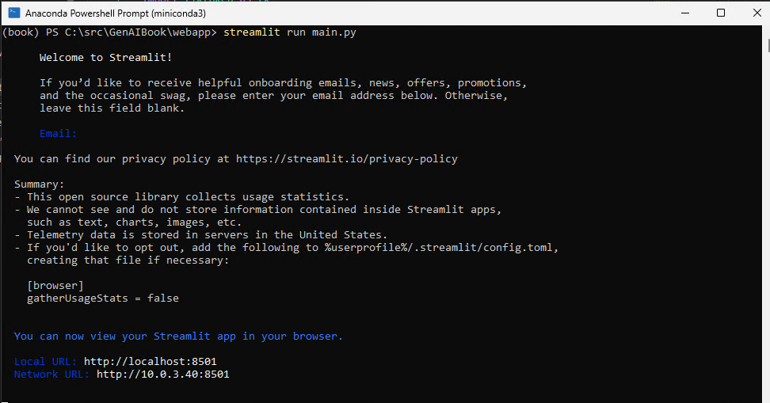
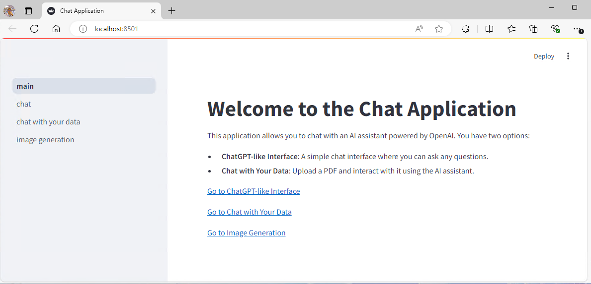
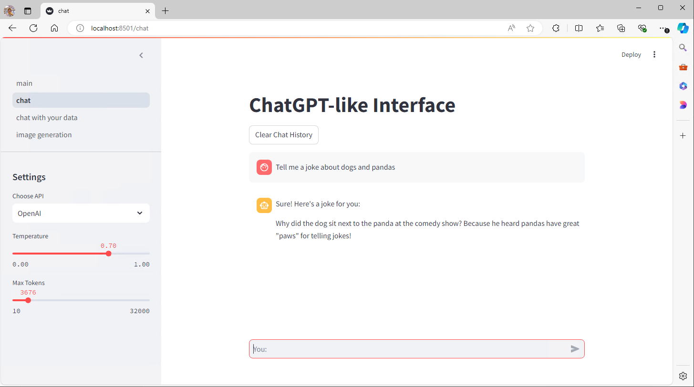

# 🗨️ Chat Application

This is a Streamlit-based web application that allows users to chat with an AI assistant powered by OpenAI. The application provides three main features:
- **ChatGPT-like Interface**: A simple chat interface where you can ask any questions.
- **Chat with Your Data**: Upload a PDF and interact with it using the AI assistant.
- **Image Generation**: Generate images using AI.

## Setup Instructions 📖

### Prerequisites

- Python 3.7 or higher
- `pip` (Python package installer)

### Installation ⚙️

1. **Clone the repository:**

    ```sh
    git clone https://github.com/bahree/GenAIBook.git
    cd GenAIBook/webapp
    ```

2. **Create a virtual environment:**

    ```sh
    python -m venv venv
    ```

3. **Activate the virtual environment:**

    - On Windows:

        ```sh
        .\venv\Scripts\activate
        ```

    - On macOS/Linux:

        ```sh
        source venv/bin/activate
        ```

4. **Install the required packages:**

    ```sh
    pip install -r requirements.txt
    ```

5. **Set up environment variables:**

    Copy the [`.env-example`](command:_github.copilot.openRelativePath?%5B%7B%22scheme%22%3A%22file%22%2C%22authority%22%3A%22%22%2C%22path%22%3A%22%2FC%3A%2Fsrc%2FBook-GenAI%2FGenAIBook%2Fwebapp%2F.env-example%22%2C%22query%22%3A%22%22%2C%22fragment%22%3A%22%22%7D%5D "c:\src\Book-GenAI\GenAIBook\webapp\.env-example") file to [`.env`](command:_github.copilot.openRelativePath?%5B%7B%22scheme%22%3A%22file%22%2C%22authority%22%3A%22%22%2C%22path%22%3A%22%2FC%3A%2Fsrc%2FBook-GenAI%2FGenAIBook%2F.env%22%2C%22query%22%3A%22%22%2C%22fragment%22%3A%22%22%7D%5D "c:\src\Book-GenAI\GenAIBook\.env") and update it with your own API keys and endpoints:

    ```sh
    cp .env-example .env
    ```

    Update the [`.env`](command:_github.copilot.openRelativePath?%5B%7B%22scheme%22%3A%22file%22%2C%22authority%22%3A%22%22%2C%22path%22%3A%22%2FC%3A%2Fsrc%2FBook-GenAI%2FGenAIBook%2F.env%22%2C%22query%22%3A%22%22%2C%22fragment%22%3A%22%22%7D%5D "c:\src\Book-GenAI\GenAIBook\.env") file with your own values:

    ```env
    OPEN_API_KEY=your-api-key
    OPENAI_MODEL_NAME=gpt-3.5-turbo

    AZURE_OPENAI_API_KEY=your-api
    AZURE_OPENAI_ENDPOINT=https://your-end-point.openai.azure.com/
    AZURE_OPENAI_API_VERSION=2024-05-01-preview
    AZURE_OPENAI_MODEL_NAME=gpt-35-turbo
    ```

### Running the Application

1. **Start the Streamlit app:** 💻

    ```sh
    streamlit run main.py
    ```
When we run this for the first time on a machine, we are asked for a email which can be skipped as shown below.


3. **Open your web browser and go to:** 👏

    ```
    http://localhost:8501
    ```
The home page will look somehing like what you can see below. The best way to navigate is using the panel on the left.


## Features

- **ChatGPT-like Interface**: Interact with an AI assistant in a chat format.
- **Chat with Your Data**: Upload a PDF and ask questions about its contents.
- **Image Generation**: Generate images using AI.

## Settings
Use the sidebar panel to change the following setings and parameters:
- AI Provider: Choose between OpenAI and Azure OpenAI.
- Temperature: A parameter that controls the randomness of the AI's responses - defaults to 0.7.
- Max Tokens: The maximum number of tokens the AI can generate in a response - defaults to 800.

## File Structure

- [`main.py`](command:_github.copilot.openRelativePath?%5B%7B%22scheme%22%3A%22file%22%2C%22authority%22%3A%22%22%2C%22path%22%3A%22%2FC%3A%2Fsrc%2FBook-GenAI%2FGenAIBook%2Fwebapp%2Fmain.py%22%2C%22query%22%3A%22%22%2C%22fragment%22%3A%22%22%7D%5D "c:\src\Book-GenAI\GenAIBook\webapp\main.py"): The main script that runs the Streamlit application.
- [`requirements.txt`](command:_github.copilot.openRelativePath?%5B%7B%22scheme%22%3A%22file%22%2C%22authority%22%3A%22%22%2C%22path%22%3A%22%2FC%3A%2Fsrc%2FBook-GenAI%2FGenAIBook%2Frequirements.txt%22%2C%22query%22%3A%22%22%2C%22fragment%22%3A%22%22%7D%5D "c:\src\Book-GenAI\GenAIBook\requirements.txt"): A file containing all the dependencies required to run the application.
- [`.env-example`](command:_github.copilot.openRelativePath?%5B%7B%22scheme%22%3A%22file%22%2C%22authority%22%3A%22%22%2C%22path%22%3A%22%2FC%3A%2Fsrc%2FBook-GenAI%2FGenAIBook%2Fwebapp%2F.env-example%22%2C%22query%22%3A%22%22%2C%22fragment%22%3A%22%22%7D%5D "c:\src\Book-GenAI\GenAIBook\webapp\.env-example"): A template file for environment variables.
- [`.env`](command:_github.copilot.openRelativePath?%5B%7B%22scheme%22%3A%22file%22%2C%22authority%22%3A%22%22%2C%22path%22%3A%22%2FC%3A%2Fsrc%2FBook-GenAI%2FGenAIBook%2F.env%22%2C%22query%22%3A%22%22%2C%22fragment%22%3A%22%22%7D%5D "c:\src\Book-GenAI\GenAIBook\.env"): A file to store environment variables (not included in the repository for security reasons).

## Screenshots

ChatGPT-like Interface:


## License

This project is licensed under the MIT License. See the [`LICENSE`](command:_github.copilot.openRelativePath?%5B%7B%22scheme%22%3A%22file%22%2C%22authority%22%3A%22%22%2C%22path%22%3A%22%2FC%3A%2Fsrc%2FBook-GenAI%2FGenAIBook%2FLICENSE%22%2C%22query%22%3A%22%22%2C%22fragment%22%3A%22%22%7D%5D "c:\src\Book-GenAI\GenAIBook\LICENSE") file for more details.

## Acknowledgements

- [Streamlit](https://streamlit.io/)
- [OpenAI](https://www.openai.com/)
